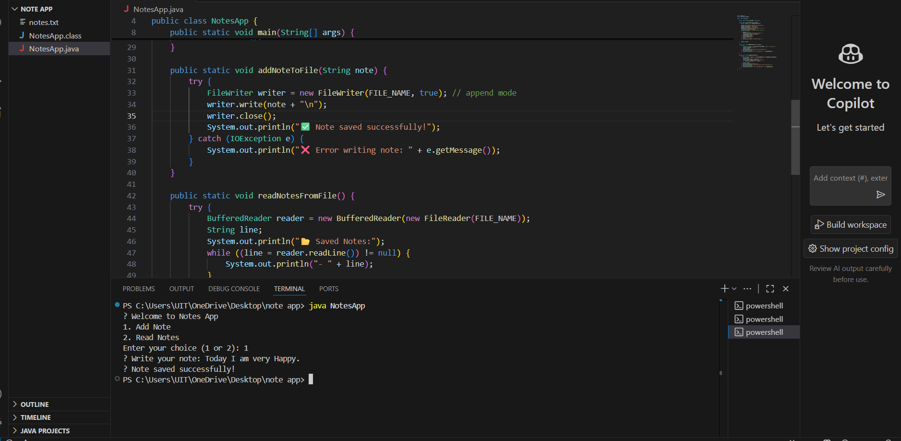

# 📓 Java Notes App – File I/O (Task 4)

> A beginner-friendly **console-based Notes Manager** built with Java, demonstrating **File I/O operations** like reading and writing to files.  
> This project is part of the **Java Developer Internship – Task 4**.

---

## 📘 Task Details

### 🏁 Task Objective:
Build a small Java application that allows users to:

- ➕ Write notes which are saved into a file
- 📖 Read all notes from the file

### 🔍 Learning Goals:
- Understand and implement **FileWriter** to save notes
- Use **FileReader** or **BufferedReader** to read stored notes
- Practice **file persistence**, **user input handling**, and **Java console interaction**

---

## 🔧 Tools & Technologies

- Java (JDK 8+)
- Visual Studio Code or any Java IDE
- Terminal / Command Prompt

---

---

## 🚀 How to Run

1. Open terminal in the project folder
2. Compile the Java code:
   ```bash
   javac NotesApp.java

## Run the program:

```bash
java NotesApp
```
## Follow the prompts to write or read notes.

## Screenshot:



## ✅ Features
1.Simple menu-driven user interface

2.Uses FileWriter to append notes

3.Uses BufferedReader for efficient reading

4.Automatically creates notes.txt if it doesn't exist

5.Clean and easy-to-understand Java code

6.Suitable for beginners learning File I/O

## 👩‍💻 Author
Name: Hemasri4

Role: Java Developer Intern

Task: 4 – Java File I/O: Notes App

🙌 Thank you for checking out my project!
Proudly created with Java by Hemasri4 💻✨


